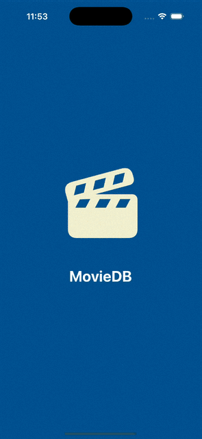

# MovieDB
## About
This iOS app tries to recreate the MovieDB interface by showing a list of selectable movies and then navigating to a screen with more details about the selected movie. The UI is built completely programmatically, without using Storyboards.

## Tech Stack
- UIKit
- Swift
- XCode version 26.2

## Features
- Table View home screen that displays a list of movies with the title, poster, scores, etc.
- Collection View screen that displays the same list of movies in a grid layout
- Clicking on a movie from the list will take you to a screen with more information about the selected movie

## Demo

